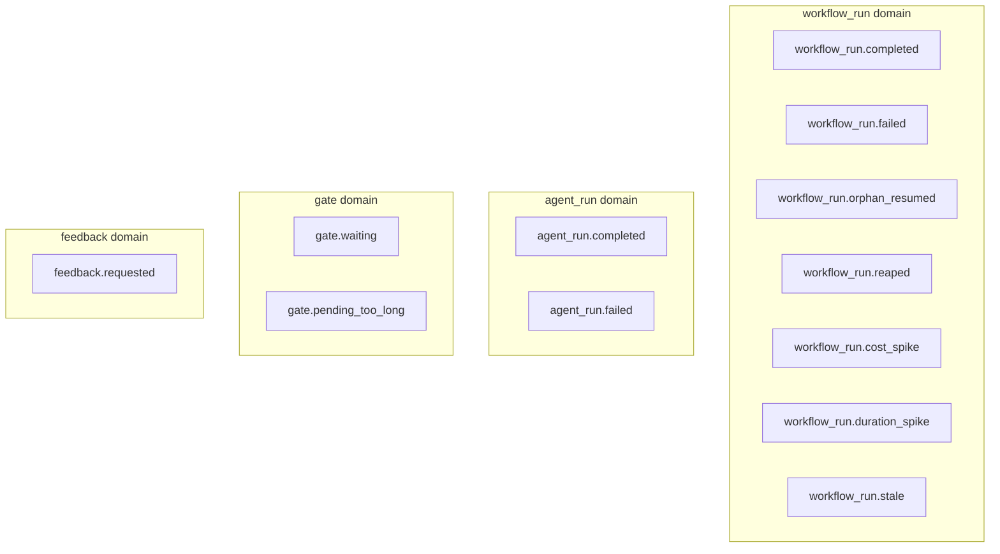
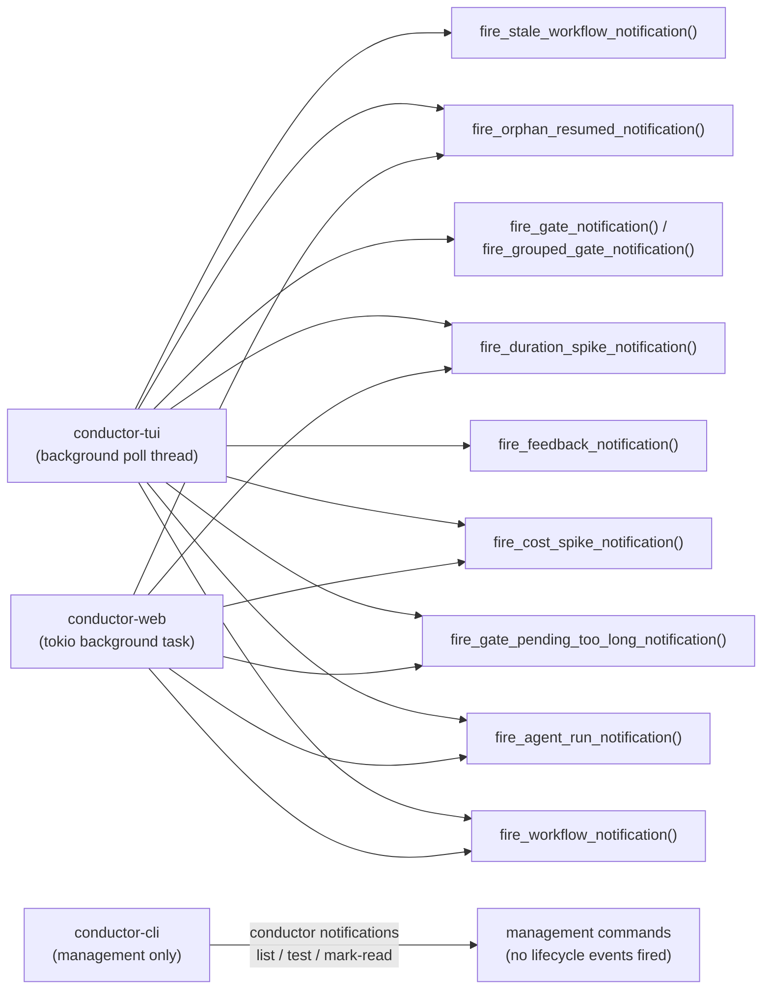
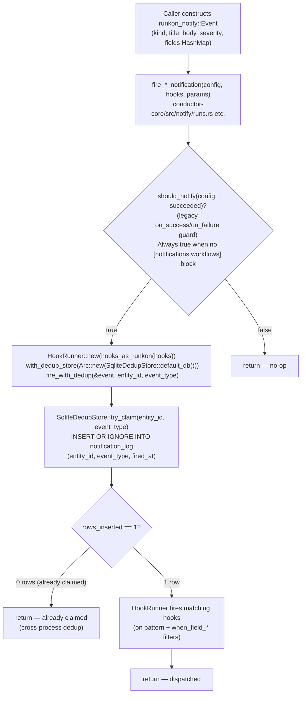
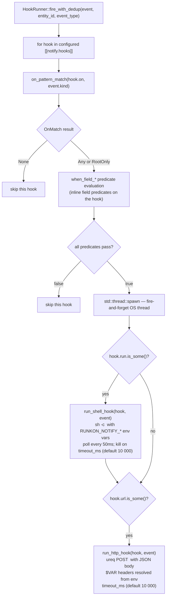
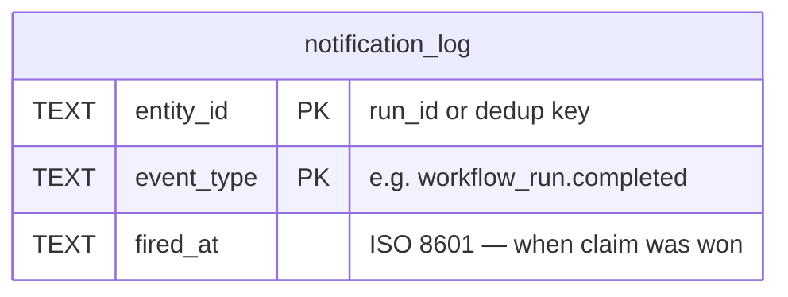

# Notification Hooks — Architecture Reference

> Source files: `conductor-core/src/notify/event.rs`, `conductor-core/src/notify/dedup.rs`, `conductor-core/src/notify/runs.rs`, `conductor-core/src/notify/anomalies.rs`, `conductor-core/src/notify/gates.rs`

This document covers the full conductor notification system: every event type and what fires it, which binaries participate, the dispatch pipeline from event construction to hook execution, filter resolution logic, and the DB table involved.

Conductor's notification dispatch is powered by the [`runkon-notify`](https://crates.io/crates/runkon-notify) crate. All in-tree notification code has been removed in favour of the upstream library.

---

## Diagram 1 — Event type taxonomy

All event kinds, grouped by domain. Events are `runkon_notify::Event` envelopes — a plain struct with `kind`, `title`, `body`, `severity`, and a `fields: HashMap<String, String>`. There is no longer a `NotificationEvent` enum in conductor-core.



The `ALL_EVENTS` constant in `conductor-core/src/notify/event.rs` lists the nine non-threshold events used to populate the hook × event matrix UI. `workflow_run.cost_spike`, `workflow_run.duration_spike`, and `gate.pending_too_long` require threshold filter fields and are excluded from that list.

---

## Diagram 2 — Binary participation

Which binaries fire which notification functions, all of which ultimately call `HookRunner::fire_with_dedup()` from `runkon-notify`.



All fire functions are defined in `conductor-core/src/notify/` and re-exported from `conductor-core/src/notify/mod.rs`.

---

## Diagram 3 — Full dispatch pipeline

The sequence from event construction through dedup and hook execution.



### HookRunner::fire_with_dedup — per-hook thread spawn



All failures in `run_shell_hook` and `run_http_hook` are logged as `tracing::warn!` and never propagated — hooks are best-effort.

`HookRunner` is provided by `runkon-notify`; it is re-exported from `conductor-core::notify::HookRunner` for use by binaries.

---

## Diagram 4 — Hook filter resolution

Conductor's `HookConfig` (TOML config struct) is translated to `runkon_notify::HookConfig` at dispatch time via `HookConfig::to_runkon_hook_config()`. Filters are encoded as `when_field_*` predicates on the `runkon_notify::HookConfig`; the upstream library evaluates them per event.

```mermaid
flowchart TD
    A["to_runkon_hook_config() — translate conductor HookConfig\nto runkon_notify::HookConfig with when_field_* predicates"]

    B{"root_workflows_only = true?"}
    C["Append :root suffix to each on arm\ne.g. workflow_run.* → workflow_run.*:root"]

    D{"workflow filter set?"}
    E["when_field_eq = (workflow_name, value)"]

    F{"repo filter set?"}
    G["when_field_in = (repo_slug, [value])"]

    H{"step filter set?"}
    I["when_field_in = (step_name, [value])"]

    J{"branch filter set?"}
    K["when_field_glob = (branch, pattern)"]

    L{"threshold_multiple set?"}
    M["when_field_gte = (multiple, value)"]

    N{"gate_pending_ms set?"}
    O["when_field_gte = (pending_ms, value)"]

    P["runkon_notify::HookConfig ready for dispatch"]

    A --> B
    B -->|"yes"| C
    B -->|"no"| D
    C --> D
    D -->|"yes"| E
    D -->|"no"| F
    E --> F
    F -->|"yes"| G
    F -->|"no"| H
    G --> H
    H -->|"yes"| I
    H -->|"no"| J
    I --> J
    J -->|"yes"| K
    J -->|"no"| L
    K --> L
    L -->|"yes"| M
    L -->|"no"| N
    M --> N
    N -->|"yes"| O
    N -->|"no"| P
    O --> P
```



### `on` pattern matching

The `on` field accepts a comma-separated list of patterns. Each sub-pattern may carry a `:root` suffix (injected automatically when `root_workflows_only = true`):

| Pattern | Matches |
|---|---|
| `*` | All events |
| `workflow_run.*` | Any `workflow_run.` event |
| `agent_run.*` | Any `agent_run.` event |
| `gate.*` | Any `gate.` event |
| `gate.waiting` | Exact event name |
| `workflow_run.completed:root` | Only root workflow completions (no parent) |
| `workflow_run.*:root` | All workflow events, root runs only |
| `feature/*` | Branch glob (used in `branch` filter, not `on`) |

The `:root` suffix causes `runkon-notify` to check that `event.fields["is_root"] == "true"`. Producers set this field when `parent_workflow_run_id.is_none()`. The `root_workflows_only` conductor config field is translated to `:root`-suffixed `on` arms at dispatch time; it is not a separate runtime check.

---

## Diagram 5 — DB table write paths



**Write sequence:**

1. `notification_log` — written via `INSERT OR IGNORE` inside `SqliteDedupStore::try_claim`. Composite PK `(entity_id, event_type)` is the cross-process lock. If a row already exists for `(run_id, "workflow_run.completed")`, the second caller's insert returns 0 rows and `fire_with_dedup` skips hook execution entirely.

**Indexes** (migration `046_notifications.sql`):
- `idx_notification_log` on `notification_log(entity_id, event_type)` — dedup lookup

`SqliteDedupStore` opens a fresh `rusqlite::Connection` per `try_claim` call (no shared mutex needed; SQLite WAL mode handles concurrent writers).

---

## Shell hook environment variables

All variables are injected into shell hook commands by `runkon-notify` when a hook fires.

> **Renamed from `CONDUCTOR_*`:** Prior to the `runkon-notify` adoption, shell hooks received `CONDUCTOR_EVENT`, `CONDUCTOR_RUN_ID`, etc. These have been replaced by the `RUNKON_NOTIFY_*` prefix. Update any existing hook scripts that reference the old variable names.

### Envelope fields (all events)

| Variable | Value | Notes |
|---|---|---|
| `RUNKON_NOTIFY_EVENT` | `workflow_run.completed` etc. | Dotted event kind |
| `RUNKON_NOTIFY_TITLE` | `"Conductor — Workflow Completed"` | Human-readable title |
| `RUNKON_NOTIFY_BODY` | `"my-wf on repo/branch"` | Human-readable body |
| `RUNKON_NOTIFY_SEVERITY` | `info` / `warning` / `error` | Severity level |

### Event fields (via `RUNKON_NOTIFY_FIELD_<UPPER_KEY>`)

All entries in the event `fields` map are injected as `RUNKON_NOTIFY_FIELD_<UPPER_KEY>`. For example, a field `run_id` becomes `RUNKON_NOTIFY_FIELD_RUN_ID`.

#### Common fields (all events)

| Variable | Example value | Notes |
|---|---|---|
| `RUNKON_NOTIFY_FIELD_RUN_ID` | ULID string | Workflow or agent run ID |
| `RUNKON_NOTIFY_FIELD_TIMESTAMP` | ISO 8601 | When the event fired |
| `RUNKON_NOTIFY_FIELD_URL` | Deep link URL | Empty string when not available |
| `RUNKON_NOTIFY_FIELD_REPO_SLUG` | `"conductor-ai"` | Repository slug |
| `RUNKON_NOTIFY_FIELD_BRANCH` | `"main"` | Branch name |
| `RUNKON_NOTIFY_FIELD_DURATION_MS` | `"12345"` | Run duration; empty string when `None` |
| `RUNKON_NOTIFY_FIELD_TICKET_URL` | Issue/ticket URL | Empty string when `None` |

#### Workflow events (`workflow_run.*`)

| Variable | Example value | Notes |
|---|---|---|
| `RUNKON_NOTIFY_FIELD_WORKFLOW_NAME` | `"ticket-to-pr"` | All `workflow_run.*` |
| `RUNKON_NOTIFY_FIELD_PARENT_WORKFLOW_RUN_ID` | parent run ULID | Empty string for root runs |
| `RUNKON_NOTIFY_FIELD_IS_ROOT` | `"true"` / `"false"` | `true` when no parent |

#### Spike events

| Variable | Example value | Notes |
|---|---|---|
| `RUNKON_NOTIFY_FIELD_MULTIPLE` | `"3.5"` | `workflow_run.cost_spike`, `workflow_run.duration_spike` |
| `RUNKON_NOTIFY_FIELD_COST_USD` | `"0.42"` | `workflow_run.cost_spike` only; absent when `None` |

#### Error events

| Variable | Example value | Notes |
|---|---|---|
| `RUNKON_NOTIFY_FIELD_ERROR` | Error message | `workflow_run.failed`, `agent_run.failed`, `workflow_run.reaped`; empty string when `None` |

#### Gate events

| Variable | Example value | Notes |
|---|---|---|
| `RUNKON_NOTIFY_FIELD_STEP_NAME` | `"human-review"` | `gate.waiting`, `gate.pending_too_long` |
| `RUNKON_NOTIFY_FIELD_PENDING_MS` | `"90000"` | `gate.pending_too_long` only |

#### Feedback events

| Variable | Example value | Notes |
|---|---|---|
| `RUNKON_NOTIFY_FIELD_PROMPT_PREVIEW` | First ~100 chars of prompt | `feedback.requested` |

---

## HTTP hook payload

HTTP hooks receive a JSON POST body built from the `runkon_notify::Event` fields. Header values starting with `$` are resolved from the process environment (e.g. `Authorization: $SLACK_TOKEN`).

Example for `workflow_run.completed`:

```json
{
  "event": "workflow_run.completed",
  "title": "Conductor — Workflow Completed",
  "body": "ticket-to-pr on conductor-ai/feat-123",
  "severity": "info",
  "fields": {
    "run_id": "01ABCDEF...",
    "timestamp": "2025-04-16T14:00:00Z",
    "url": "https://conductor.example.com/repos/.../runs/...",
    "repo_slug": "conductor-ai",
    "branch": "feat/123",
    "duration_ms": "42000",
    "workflow_name": "ticket-to-pr",
    "ticket_url": "https://github.com/org/repo/issues/123",
    "parent_workflow_run_id": "",
    "is_root": "true"
  }
}
```

See `docs/examples/hooks/` for working shell and HTTP hook examples.

---

## Security model

Shell hooks run user-configured commands via `sh -c <hook.run>`. The command string is read directly from `config.toml` and is **not** validated, sandboxed, or restricted to an allow-list. Event data is passed safely through environment variables, but the hook body itself executes with full shell privileges as the conductor user.

**Threat:** anyone who can write to `~/.conductor/config.toml` — or to a repo-local `.conductor/config.toml` that conductor reads — can achieve arbitrary code execution under the conductor user on the next matching event.

**Implications:**

- Treat conductor config files as trusted input. Do not source them from a shared writable location, and do not check repo-local `.conductor/config.toml` from a branch you would not run code from.
- Untrusted PRs that modify `.conductor/config.toml` should be reviewed for hook additions/changes the same way you would review a `Makefile` change — they are equivalent in privilege.
- HTTP hooks have a smaller blast radius (only the configured URL is reachable; secrets in `$VAR` headers come from the host process environment), but the URL itself is still arbitrary — apply the same trust model to the config file.
- Conductor does not currently provide a hook allow-list, sandbox, or signed-config mechanism. Defense relies on filesystem permissions on the config file.
