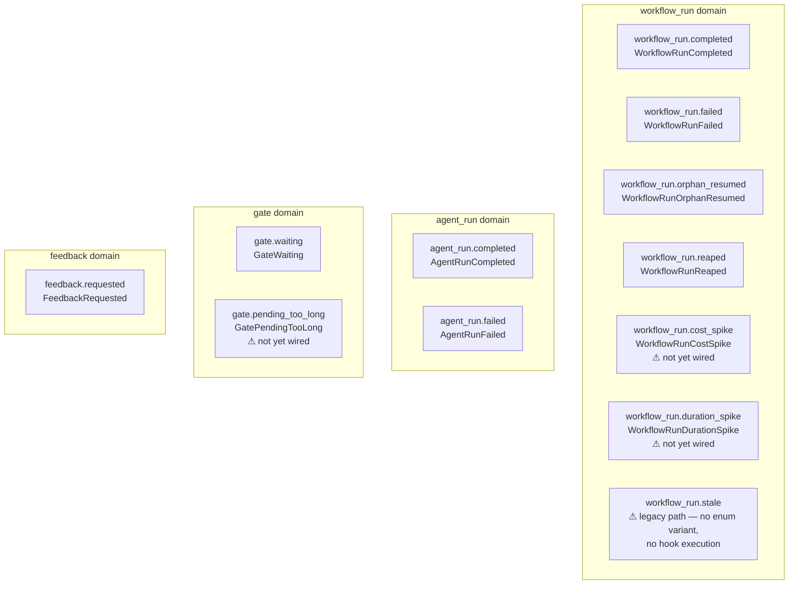
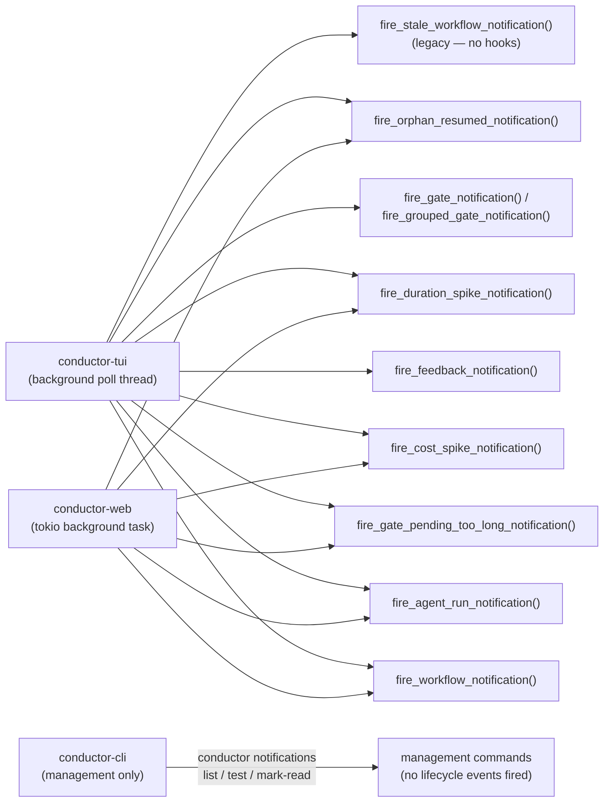
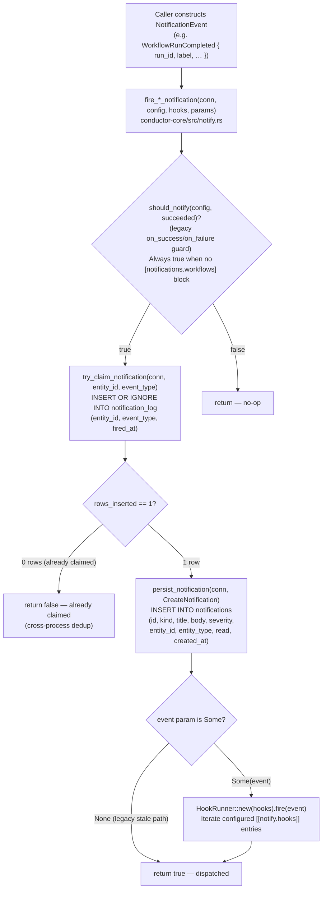
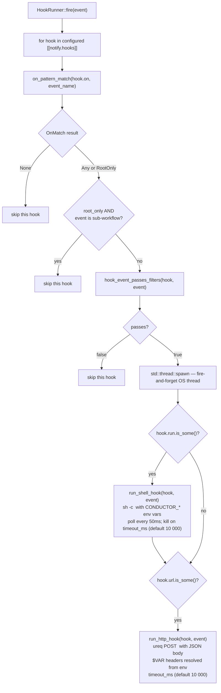
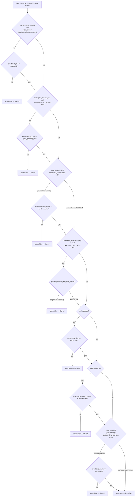
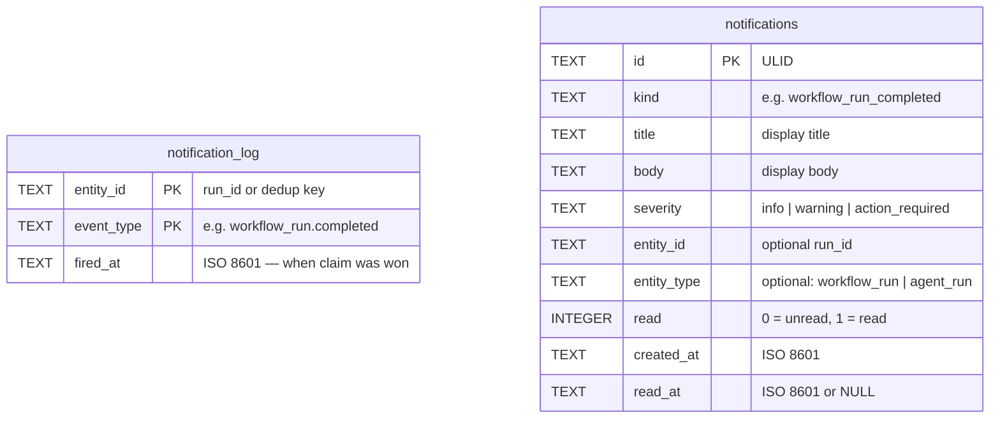

# Notification Hooks — Architecture Reference

> Source files: `conductor-core/src/notification_event.rs`, `conductor-core/src/notification_hooks.rs`, `conductor-core/src/notify.rs`

This document covers the full conductor notification system: every event type and what fires it, which binaries participate, the dispatch pipeline from event construction to hook execution, filter resolution logic, and the two DB tables involved.

---

## Diagram 1 — Event type taxonomy

All 11 `NotificationEvent` enum variants, grouped by domain. Three variants are defined in the enum but are not yet wired to any construction site (no callers outside tests). `workflow_run.stale` is a 12th event name that exists in `ALL_EVENTS` but has **no** corresponding enum variant — it fires through a legacy path that writes only to the in-app notification log and never invokes hooks.



**Not yet wired** means the variant is defined in the enum but no code constructs it outside of test factories. These are reserved for follow-on analytics and monitoring PRs.

**Legacy stale path** (`fire_stale_workflow_notification`): calls `dispatch_notification` with `event: None` and `hooks: &[]`, so it writes an in-app `notifications` row and a `notification_log` dedup row but never reaches `HookRunner::fire`.

---

## Diagram 2 — Binary participation

Which binaries fire which notification functions, all of which ultimately call `dispatch_notification()` in `conductor-core`.



All fire functions are defined in `conductor-core/src/notify.rs` and re-exported from `conductor-tui/src/notify.rs` and `conductor-web/src/notify.rs` as thin re-export modules.

---

## Diagram 3 — Full dispatch pipeline

The sequence from event construction through dedup, in-app persistence, and hook execution.



### HookRunner::fire — per-hook thread spawn



All failures in `run_shell_hook` and `run_http_hook` are logged as `tracing::warn!` and never propagated — hooks are best-effort.

---

## Diagram 4 — Hook filter resolution

Each optional filter field on a `HookConfig` acts as an independent gate. Non-applicable filters auto-pass (e.g. `workflow` filter is ignored for agent/gate/feedback events).



### `on` pattern matching

The `on` field accepts a comma-separated list of patterns. Each sub-pattern may carry a `:root` suffix:

| Pattern | Matches |
|---|---|
| `*` | All events |
| `workflow_run.*` | Any `workflow_run.` event |
| `agent_run.*` | Any `agent_run.` event |
| `gate.*` | Any `gate.` event |
| `gate.waiting` | Exact event name |
| `workflow_run.completed:root` | Only root workflow completions (no parent) |
| `workflow_run.*:root` | All workflow events, root runs only |
| `feature/*` | Branch glob (used in `branch` filter, not `on`) |

The `:root` suffix triggers `OnMatch::RootOnly`; the `root_workflows_only` filter field is a separate orthogonal mechanism that checks `parent_workflow_run_id.is_none()`.

---

## Diagram 5 — DB table write paths



**Write sequence:**

1. `notification_log` — written first via `INSERT OR IGNORE` (dedup claim). Composite PK `(entity_id, event_type)` is the cross-process lock. If a row already exists for `(run_id, "workflow_run.completed")`, the second caller's `INSERT OR IGNORE` returns 0 rows and the whole dispatch is aborted.
2. `notifications` — written only after a successful claim. Stores the in-app bell/feed entry. Never deduplicated by the application (the `notification_log` claim guarantees at-most-one).

**Indexes** (migration `046_notifications.sql`):
- `idx_notifications_read` on `notifications(read)` — fast unread-count query
- `idx_notifications_created_at` on `notifications(created_at)` — feed ordering

**Severity values** used in practice:
- `info` — completed, orphan_resumed
- `warning` — failed, reaped, stale, gate.waiting, feedback.requested
- `action_required` — (reserved; not currently used)

---

## Shell hook environment variables

All `CONDUCTOR_*` variables injected into shell hook commands via `NotificationEvent::to_env_vars()`.

### Common fields (all events)

| Variable | Value | Notes |
|---|---|---|
| `CONDUCTOR_EVENT` | `workflow_run.completed` etc. | Dotted event name |
| `CONDUCTOR_RUN_ID` | ULID string | Workflow or agent run ID |
| `CONDUCTOR_LABEL` | `"my-wf on repo/branch"` | Human-readable display label |
| `CONDUCTOR_TIMESTAMP` | ISO 8601 | When the event fired |
| `CONDUCTOR_URL` | Deep link URL | Empty string when not available (non-web contexts) |
| `CONDUCTOR_REPO_SLUG` | `"conductor-ai"` | Repository slug |
| `CONDUCTOR_BRANCH` | `"main"` | Branch name |
| `CONDUCTOR_DURATION_MS` | `"12345"` | Run duration; empty string when `None` |
| `CONDUCTOR_TICKET_URL` | Issue/ticket URL | Empty string when `None` |

### Workflow events (`workflow_run.*`)

| Variable | Value | Events |
|---|---|---|
| `CONDUCTOR_WORKFLOW_NAME` | `"ticket-to-pr"` | All `workflow_run.*` |
| `CONDUCTOR_PARENT_WORKFLOW_RUN_ID` | parent run ULID | Empty string for root runs |

### Spike events

| Variable | Value | Events |
|---|---|---|
| `CONDUCTOR_MULTIPLE` | `"3.5"` | `workflow_run.cost_spike`, `workflow_run.duration_spike` |
| `CONDUCTOR_COST_USD` | `"0.42"` | `workflow_run.cost_spike` only; absent when `None` |

### Error events

| Variable | Value | Events |
|---|---|---|
| `CONDUCTOR_ERROR` | Error message | `workflow_run.failed`, `agent_run.failed`, `workflow_run.reaped`; empty string when `None` |

### Gate events

| Variable | Value | Events |
|---|---|---|
| `CONDUCTOR_STEP_NAME` | `"human-review"` | `gate.waiting`, `gate.pending_too_long` |
| `CONDUCTOR_PENDING_MS` | `"90000"` | `gate.pending_too_long` only |

### Feedback events

| Variable | Value | Events |
|---|---|---|
| `CONDUCTOR_PROMPT_PREVIEW` | First ~100 chars of prompt | `feedback.requested` |

---

## HTTP hook payload

HTTP hooks receive `NotificationEvent::to_json()` as a JSON POST body. The shape mirrors the env var table above: common fields are always present; `url`, `duration_ms`, `ticket_url`, and `parent_workflow_run_id` are omitted when `None`. Header values starting with `$` are resolved from the process environment (e.g. `Authorization: $SLACK_TOKEN`).

Example for `workflow_run.completed`:

```json
{
  "event": "workflow_run.completed",
  "run_id": "01ABCDEF...",
  "label": "ticket-to-pr on conductor-ai/feat-123",
  "timestamp": "2025-04-16T14:00:00Z",
  "url": "https://conductor.example.com/repos/.../runs/...",
  "repo_slug": "conductor-ai",
  "branch": "feat/123",
  "duration_ms": 42000,
  "workflow_name": "ticket-to-pr",
  "ticket_url": "https://github.com/org/repo/issues/123"
}
```

See `docs/examples/hooks/` for working shell and HTTP hook examples.
