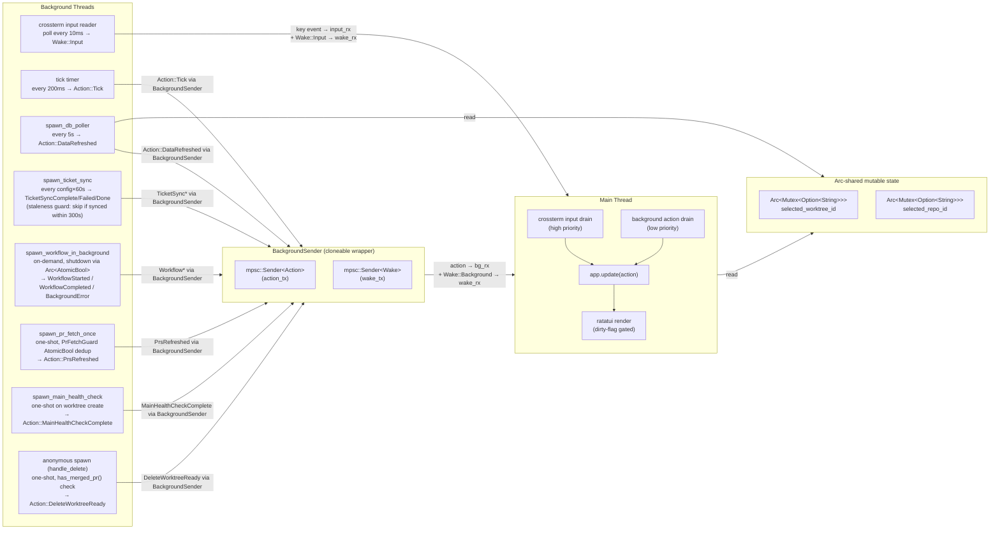
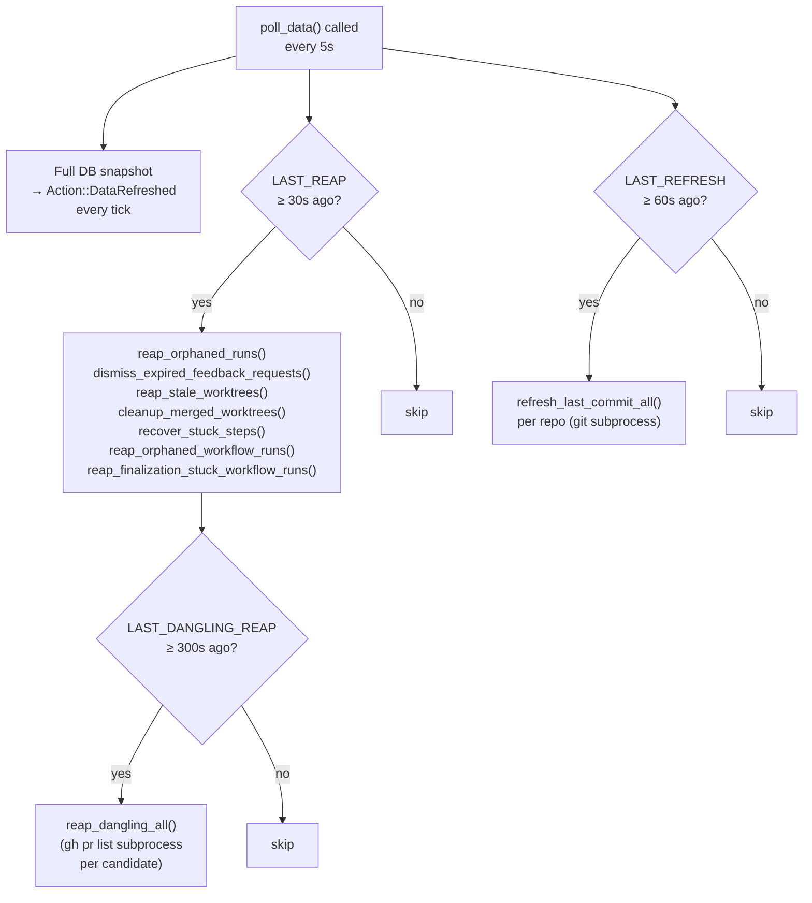
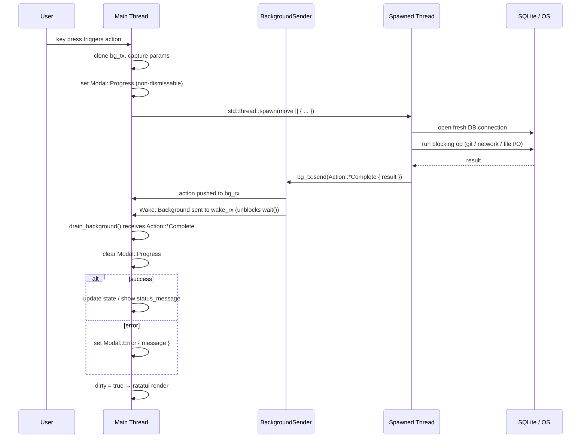

# TUI Threading Model

This document diagrams the conductor-tui threading architecture: how the main thread,
background threads, and channels interact to keep the UI responsive while all blocking
work happens off-thread.

---

## Diagram 1 — Thread topology

**Drain order:** `input_rx` is always drained before `bg_rx`. The main loop blocks on
`wake_rx` (blocking nothing), then processes input first, background second.
Rendering only happens when the `dirty` flag is set by `app.update()`.

---

## Diagram 2 — DB poll throttle tiers

The `spawn_db_poller` thread runs a full DB snapshot every **5 seconds**, but several
sub-operations inside `poll_data()` are further throttled with static `AtomicI64`
timestamps to avoid hammering local and remote resources on every tick.

| Constant | Interval | What runs |
|---|---|---|
| _(outer tick)_ | 5s | Full DB snapshot → `DataRefreshed` |
| `LAST_REAP` | 30s | Orphan reaping, stale worktree cleanup, stuck step recovery |
| `LAST_REFRESH` | 60s | `last_commit_at` refresh via git subprocess |
| `LAST_DANGLING_REAP` | 300s | `reap_dangling_all()` — `gh pr list` per candidate |
| `TICKET_SYNC_STALE_SECS` | 300s | Ticket sync staleness guard — skip if recently synced |

---

## Diagram 3 — Canonical blocking-op handoff

This sequence matches the required pattern from CLAUDE.md's TUI Threading Rule.
Every blocking call (git, subprocess, network, large file I/O) follows this flow.

---

## Reference implementations

These four call sites already follow the canonical pattern above.

| Implementation | File | Blocking op | Action sent |
|---|---|---|---|
| PR merged check | `crud_operations.rs:442` | `has_merged_pr()` — `gh pr list` subprocess | `Action::DeleteWorktreeReady` |
| Main health check | `crud_operations.rs:564` | `check_main_health()` — git fetch/status | `Action::MainHealthCheckComplete` |
| Workflow execution | `workflow_management.rs:1175` | `execute_workflow_standalone()` — conductor subprocess | `WorkflowStarted` / `WorkflowCompleted` |
| PR fetch | `background.rs:1359` | `list_open_prs()` — `gh pr list` subprocess | `Action::PrsRefreshed` |

---

## Anti-patterns

> **Never do any of the following on the main thread:**
>
> - Call `std::process::Command` (git, gh, conductor, any subprocess)
> - Read large files in the render path (agent logs, workflow output)
> - Run slow or write-heavy DB queries while holding render budget
> - Use `.unwrap()` panics inside spawned threads — send an error result back instead;
>   a panic in a spawned thread cannot be caught on the main thread and will crash the TUI
