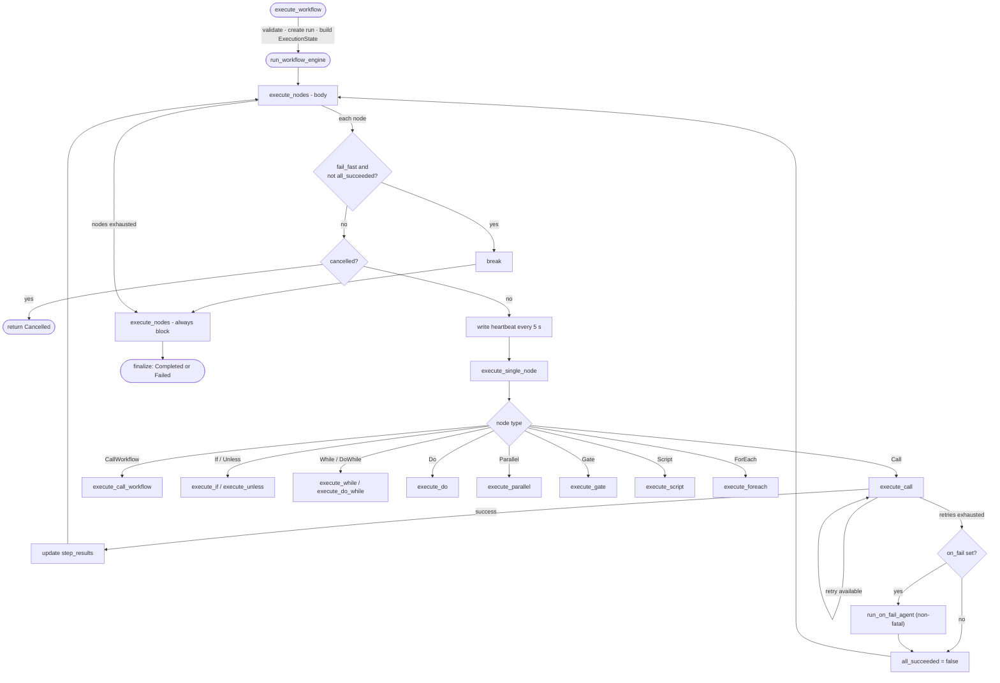
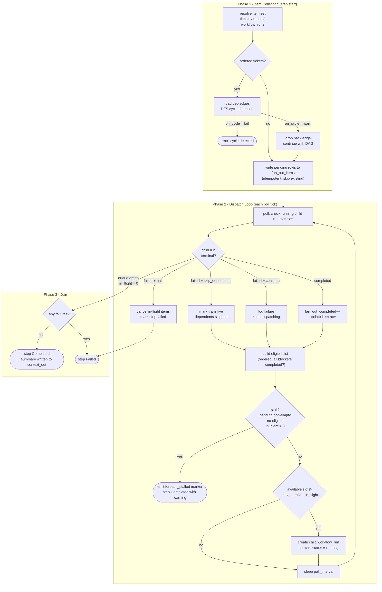
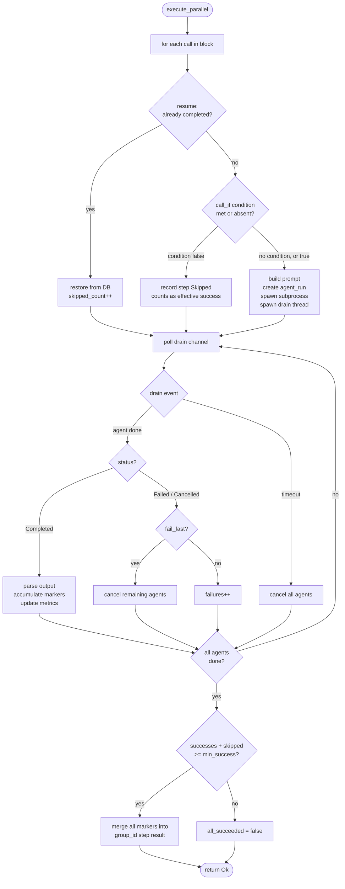
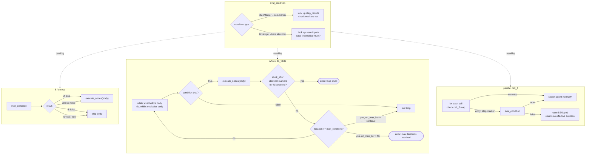
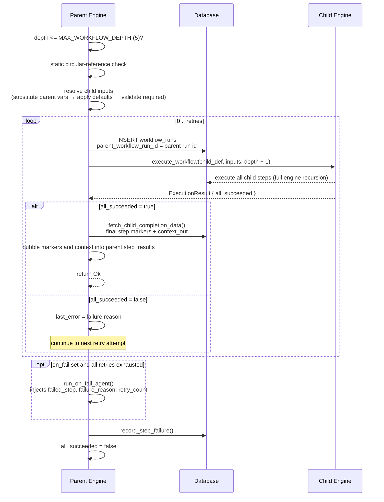
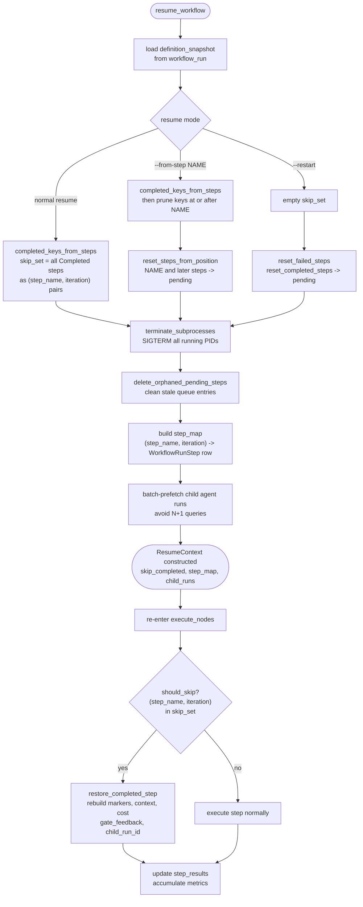

# Workflow Engine

This document describes the design of conductor's workflow engine — how it
works, why it works that way, and what tradeoffs were made.

---

## Core idea

A workflow is a **directed execution graph over agents**. The `.wf` file
describes the graph — what runs, in what order, under what conditions. Agent
`.md` files contain the prompts. The two concerns are fully separated: any
agent can be reused across workflows, and any workflow can be understood without
reading the agent prompts.

---

## File format

### `.wf` DSL

Workflow files live in `.conductor/workflows/<name>.wf`. The format is a
minimal custom DSL parsed by a hand-written recursive descent parser
(the `workflow_dsl` module in `conductor-core/src/workflow_dsl/`, split across
`lexer.rs`, `parser.rs`, `types.rs`, `validation.rs`, `api.rs`, and
`script_utils.rs`).

**Why a custom DSL instead of TOML/YAML/JSON?**

TOML cannot naturally express polymorphic node arrays — a `[[steps]]` table
that sometimes contains a loop, sometimes a parallel block, sometimes a gate
requires either awkward type tags or deeply nested inline tables. YAML and JSON
could represent the AST but produce verbose, hard-to-scan files for what is
fundamentally a sequential program. The DSL reads like pseudocode, which is the
right level of abstraction for workflow authors.

**Example:**

```
workflow ticket-to-pr {
  meta {
    description = "Full development cycle"
    trigger     = "manual"
    targets     = ["worktree"]
  }

  inputs {
    ticket_id  required
    skip_tests boolean
  }

  call plan { output = "task-plan" }

  call implement {
    retries = 2
    on_fail = diagnose
  }

  call push-and-pr

  parallel {
    output    = "review-findings"
    with      = ["review-diff-scope"]
    fail_fast = false
    call review-architecture
    call review-security
    call review-performance
  }

  call review-aggregator { output = "review-aggregator" }

  while review-aggregator.has_review_issues {
    max_iterations = 3
    stuck_after    = 2
    on_max_iter    = fail

    call address-reviews

    parallel {
      output    = "review-findings"
      with      = ["review-diff-scope"]
      fail_fast = false
      call review-architecture
      call review-security
      call review-performance
    }

    call review-aggregator { output = "review-aggregator" }
  }

  gate human_review {
    prompt     = "Review agent findings before merging."
    timeout    = "48h"
    on_timeout = fail
  }

  if review-aggregator.has_critical_issues {
    call escalate
  }

  always {
    call notify-result
  }
}
```

### Grammar

```
workflow_file  := "workflow" IDENT "{" meta? inputs? node* "}"
meta           := "meta" "{" kv* "}"
                  # requires: targets = [STRING+]
                  # optional: description = STRING, trigger = STRING
inputs         := "inputs" "{" input_decl* "}"
input_decl     := IDENT input_modifier*
input_modifier := "required" | "boolean" | "default" "=" STRING | "description" "=" STRING
                  # boolean inputs are never required; absence = "false"
node           := call | if | unless | while | do_while | do | parallel | gate | always | script | foreach
call           := "call" IDENT ("{" kv* "}")?
if             := "if" condition "{" kv* node* "}"
unless         := "unless" condition "{" kv* node* "}"
while          := "while" condition "{" kv* node* "}"
do_while       := "do" "{" kv* node* "}" "while" condition
do             := "do" "{" kv* node* "}"
parallel       := "parallel" "{" kv* call* "}"
gate           := "gate" gate_name "{" kv* "}"
always         := "always" "{" node* "}"
script         := "script" IDENT "{" kv* "}"
                  # requires: run = STRING (script path)
                  # optional: env = { KEY = STRING }, timeout = NUMBER, retries = NUMBER, on_fail = IDENT
foreach        := "foreach" IDENT "{" foreach_kv* "}"
foreach_kv     := "over"          "=" ("tickets" | "repos" | "workflow_runs")
               | "scope"         "=" scope_block
               | "filter"        "=" map
               | "ordered"       "=" ("true" | "false")
               | "on_cycle"      "=" ("fail" | "warn")
               | "max_parallel"  "=" NUMBER
               | "workflow"      "=" STRING
               | "inputs"        "=" map
               | "on_child_fail" "=" ("halt" | "continue" | "skip_dependents")
scope_block    := "{" ("ticket_id" | "label") "=" STRING "}"
condition      := IDENT "." IDENT   # step.marker
               | IDENT              # bare boolean input name
gate_name      := "human_approval" | "human_review" | "pr_approval" | "pr_checks"
kv             := IDENT "=" value
value          := STRING | NUMBER | IDENT | array | map
array          := "[" (STRING ("," STRING)*)? "]"
map            := "{" (IDENT "=" STRING)* "}"
```

Identifiers allow `[a-zA-Z0-9_-]`. This is intentional — agent names like
`push-and-pr` and `lint-fix-impl` read naturally with hyphens.

---

## Constructs

### `call`

Runs a single agent to completion. The agent name is resolved to a `.md` file
(see [Agent resolution](#agent-resolution) below).

| Option | Description |
|---|---|
| `retries = N` | Retry the step up to N times on failure |
| `on_fail = <agent>` | Fallback agent if all retries are exhausted |
| `with = [<snippet>, ...]` | Prompt snippets to append to the agent prompt |

The `on_fail` agent receives additional template variables: `{{failed_step}}`,
`{{failure_reason}}`, `{{retry_count}}`, and `{{prior_context}}`.

`with` accepts a single string or an array of strings. Each value names a
`.md` file loaded from `.conductor/prompts/` and appended to the agent prompt
after variable substitution. See [Prompt snippets](#prompt-snippets) below.

### `if` / `unless` / `while`

Conditional and looping control flow based on **markers** emitted by a prior
step, or on **boolean inputs**.

```
if review.has_review_issues { ... }

unless build.has_errors {
  call deploy
}

# Boolean input condition: bare identifier (no dot)
if skip_tests {
  call skip-test-suite
}

while review.has_review_issues {
  max_iterations = 5
  stuck_after    = 3
  on_max_iter    = fail
  ...
}
```

A condition is either `<step>.<marker>` or a bare identifier naming a boolean
input. For `if` with a `step.marker` condition, the engine checks whether the
named step's most recent `CONDUCTOR_OUTPUT` includes that marker string in its
`markers` array. For a boolean input condition, the body executes when the
input value is `"true"`. `unless` is the inverse — the body executes when the
condition is **absent** or **false**.

| `while` option | Required | Description |
|---|---|---|
| `max_iterations` | Yes | Hard cap on iterations |
| `stuck_after` | No | Fail if marker set is identical for N consecutive iterations |
| `on_max_iter` | No | `fail` (default) or `continue` when cap is reached |

**Why markers instead of free-text scanning?** An earlier design used
`contains()` on agent output text. An agent saying "there are no
has_review_issues" would evaluate to true. Structured markers eliminate this
class of bugs entirely.

### `do {} while`

C-style do-while loop: the body always executes at least once, and the
condition is checked **after** each iteration. The loop continues as long as
the named step's most recent output includes the given marker.

```
do {
  max_iterations = 5
  stuck_after    = 3
  on_max_iter    = fail
  call fix-impl
  call verify
} while verify.has_failures
```

Supports the same loop options as `while`:

| Option | Required | Description |
|---|---|---|
| `max_iterations` | Yes | Hard cap on iterations |
| `stuck_after` | No | Fail if marker set is identical for N consecutive iterations |
| `on_max_iter` | No | `fail` (default) or `continue` when cap is reached |

### `do`

A plain sequential grouping block. Runs all body nodes in order and supports
block-level `output` and `with` options that are inherited by every `call`
inside the block (call-level values override block-level).

```
do {
  output = "review-summary"
  with   = ["review-diff-scope"]
  call review-security
  call review-style
}
```

| Option | Description |
|---|---|
| `output = <schema>` | Output schema applied to every call in the block (call-level overrides) |
| `with = [<snippet>, ...]` | Prompt snippets prepended to every call's snippet list |

Unlike `parallel`, `do` runs steps sequentially and its body may contain any
node type (not just `call`).

### `parallel`

Runs multiple agents concurrently. All agents in a parallel block share the
same worktree, so they must be read-only or operate on non-overlapping files.

| Option | Description |
|---|---|
| `fail_fast` | If true (default), cancel remaining agents when one fails |
| `min_success = N` | Minimum agents that must succeed; default is all |
| `with = [<snippet>, ...]` | Prompt snippets applied to every call in the block |

Individual calls within a `parallel` block can add their own options:

| Per-call option | Description |
|---|---|
| `output = "<schema>"` | Override the block-level output schema for this call |
| `with = [<snippet>, ...]` | Additional prompt snippets appended after block-level snippets |
| `if = "step.marker"` | Run this call only if the named prior step emitted the named marker |

```
parallel {
  with = ["review-diff-scope"]
  call review-security
  call review-migrations { with = ["migration-rules"] }
  call review-db-migrations { if = "detect-db-migrations.has_db_migrations" }
}
```

**`if` semantics:** the call is skipped entirely if the named prior step did not
emit the named marker. The step is recorded in the DB with `status = skipped` so it is
visible in `workflow run-show` and the TUI, but contributes no markers or context to the
parallel block's aggregate output. The parallel block still succeeds (skipped calls count
toward `effective_successes`). On resume, condition-skipped steps re-evaluate — they are
not treated as completed.

Block-level `with` snippets are prepended; per-call `with` snippets are appended
after them. See [Prompt snippets](#prompt-snippets) below.

Markers from all completed agents are merged into a single set for downstream
conditions.

### `gate`

Pauses execution until an external condition is met. The workflow run enters
`waiting` status.

**Human gates** require action through conductor (CLI, TUI, or web):

```
gate human_approval {
  prompt     = "Review PLAN.md before implementation begins."
  timeout    = "24h"
  on_timeout = fail
}

gate human_review {
  prompt     = "Review agent findings. Add notes if needed."
  timeout    = "48h"
  on_timeout = continue
}
```

`human_review` accepts written feedback, injected into the next step as
`{{gate_feedback}}`. This lets a human redirect the next agent without
modifying files.

**Automated gates** poll an external signal:

```
gate pr_approval { min_approvals = 1; timeout = "72h"; on_timeout = fail }
gate pr_checks   { timeout = "2h"; on_timeout = fail }
```

Use `mode = "review_decision"` to delegate to GitHub's branch-protection-aware
merge status instead of counting raw approvals. This correctly handles repos
requiring 1, 2, or N approvals without hardcoding a count:

```
gate pr_approval {
  mode       = "review_decision"  # passes when GitHub reviewDecision == APPROVED
  timeout    = "72h"
  on_timeout = fail
}
```

> **Note:** If the repo has no branch protection rules, `reviewDecision` may
> always return `null`. Use `min_approvals` mode instead for such repos.

| Option | Applies to | Description |
|---|---|---|
| `prompt` | human gates | Message shown to the approver |
| `min_approvals` | `pr_approval` | GitHub approvals required (default 1) |
| `mode` | `pr_approval` | `min_approvals` (default) or `review_decision` |
| `timeout` | all | Duration string: `"2h"`, `"24h"`, `"72h"` |
| `on_timeout` | all | `fail` (default) or `continue` |

**Gate CLI commands:**
```
conductor workflow gate-approve  <run-id>
conductor workflow gate-reject   <run-id>
conductor workflow gate-feedback <run-id> "<text>"
```

### `always`

Runs after the main body regardless of success or failure. Receives
`{{workflow_status}}` (`"completed"` or `"failed"`). Failures in `always`
steps are logged but do not change the workflow's terminal status.

### `foreach`

Fans out over a collection of items — tickets, repos, or workflow runs — and
runs a child workflow for each one. Items are processed up to `max_parallel`
concurrently.

```
foreach sprint-work {
  over          = tickets
  scope         = { ticket_id = "{{inputs.root_ticket_id}}" }
  ordered       = true
  max_parallel  = 3
  workflow      = "ticket-to-pr"
  inputs        = { ticket_id = "{{item.id}}" }
  on_child_fail = skip_dependents
}
```

#### Options

| Option | Required | Default | Description |
|---|---|---|---|
| `over` | Yes | — | Item type: `tickets`, `repos`, or `workflow_runs` |
| `max_parallel` | Yes | — | Maximum concurrent child workflow runs |
| `workflow` | Yes | — | Name of the `.wf` file to run for each item |
| `inputs` | No | `{}` | Input values passed to each child workflow; supports `{{item.*}}` substitution |
| `scope` | tickets only | — | Limits the ticket set: `{ ticket_id = "..." }` (children of that ticket) or `{ label = "..." }` (tickets with that label) |
| `filter` | workflow_runs only (required) | — | Narrows the run set by `status` (`completed`, `failed`, `cancelled`) or `workflow_name` |
| `ordered` | tickets only | `false` | When `true`, enables dep-aware dispatch via `get_ready_tickets()` |
| `on_cycle` | tickets + ordered | `fail` | What to do when a ticket dependency cycle is detected: `fail` or `warn` (breaks the cycle by dropping the back-edge) |
| `on_child_fail` | No | `continue` (repos/workflow_runs), `skip_dependents` (ordered tickets) | `halt`, `continue`, or `skip_dependents` |

#### `over` types and `{{item.*}}` fields

**`over = tickets`**

Fans out over tickets in the workflow's repo. `scope` is required. With
`ordered = true`, the engine uses `get_ready_tickets()` to hold items whose
blockers are not yet completed; without it, all in-scope tickets are dispatched
immediately.

| `{{item.*}}` field | Description |
|---|---|
| `{{item.id}}` | Ticket ULID |
| `{{item.title}}` | Ticket title |
| `{{item.url}}` | Ticket URL |
| `{{item.source_id}}` | Source system ID (e.g., GitHub issue number) |
| `{{item.state}}` | Ticket state (`open`, `closed`, etc.) |
| `{{item.labels}}` | Comma-separated label list |

**`over = repos`**

Fans out over all repos registered in conductor. No `scope` or `ordered`
options apply. A `filter` key is accepted by the parser but not evaluated
in v1 (validator emits a warning).

| `{{item.*}}` field | Description |
|---|---|
| `{{item.slug}}` | Repo slug identifier |
| `{{item.local_path}}` | Absolute path to the local repo clone |
| `{{item.remote_url}}` | Remote URL |

**`over = workflow_runs`**

Fans out over workflow runs. `filter` is required — without it the set is
every terminal run in the DB, which is almost never the right intent. Only
terminal runs (`completed`, `failed`, `cancelled`) are eligible.

| `{{item.*}}` field | Description |
|---|---|
| `{{item.id}}` | Workflow run ULID |
| `{{item.workflow_name}}` | Name of the workflow that produced the run |
| `{{item.status}}` | Terminal status (`completed`, `failed`, `cancelled`) |
| `{{item.started_at}}` | ISO 8601 start timestamp |
| `{{item.ticket_id}}` | Ticket ULID the run was associated with, if any |

> **`{{item.*}}` scope:** These template variables are substituted into the
> child workflow's `inputs` map at dispatch time. They are not available inside
> parent workflow agent prompts.

#### `on_child_fail` semantics

| Value | Semantics |
|---|---|
| `halt` | Cancel in-flight child runs and fail the step immediately |
| `continue` | Log the failure and keep dispatching remaining items. Step succeeds if at least one child succeeded. |
| `skip_dependents` | *(tickets + `ordered = true` only)* Mark the failed ticket's transitive dependents as `skipped`. Unrelated tickets continue normally. |

#### Engine execution model

**Phase 1 — item collection (at step start)**

1. Resolve the full item set from the DB based on `over`, `scope`, and `filter`.
2. For `over = tickets` with `ordered = true`: load `ticket_dependencies` edges
   within the set; run DFS cycle detection; fail or warn based on `on_cycle`.
3. Write one `workflow_run_step_fan_out_items` row per item with `status = 'pending'`.

Cycle detection runs at step start, not at `workflow validate` time. The item
set is runtime data — `{{inputs.root_ticket_id}}` cannot be resolved statically.

**Phase 2 — dispatch loop (each DB poll tick)**

1. Query `workflow_run_step_fan_out_items` for `pending` items in this step.
2. For `ordered = true` tickets: filter to items whose blockers are all
   `completed`. For all other types: all `pending` items are eligible.
3. Compute `available_slots = max_parallel - in_flight_count`.
4. Dispatch up to `available_slots` items by creating child `workflow_runs`
   linked via `parent_workflow_run_id`; update row status to `running`.
5. **Done condition:** queue empty and `in_flight_count == 0` → succeed or fail
   based on child outcomes and `on_child_fail`.
6. **Stall condition:** queue non-empty but no items are eligible and
   `in_flight_count == 0` → all remaining items are permanently blocked; the
   step ends with `status = completed` and a warning marker in `context_out`.
   The parent workflow is not failed. A stall is a data condition, not an
   executor error.

**Phase 3 — completion handling**

When a child run reaches a terminal state:

1. Update the `workflow_run_step_fan_out_items` row and `fan_out_*` counters.
2. Apply `on_child_fail` semantics if failed.
3. For `skip_dependents`: walk the dep graph from the failed ticket and mark
   all transitively blocked items as `skipped`.
4. Re-evaluate the dispatch loop on the next tick.

The `foreach` step's own output is a summary context:
```json
{
  "markers": [],
  "context": "foreach sprint-work: 12 completed, 1 failed, 2 skipped of 15 tickets"
}
```

#### Resumability

On restart, the engine reconstructs the in-memory queue from
`workflow_run_step_fan_out_items`:

- `pending` → add to dispatch queue (not yet dispatched)
- `running` → child run exists; if orphaned, apply `on_child_fail` semantics
- `completed` | `failed` | `skipped` → already terminal, skip

No work is re-dispatched. Consistent with the engine's snapshot-based resume
model.

#### `workflow_runs` idempotency

When collecting items for a `workflow_runs` fan-out, the engine excludes any
run already present as an `item_id` in `workflow_run_step_fan_out_items`
(regardless of child run outcome). This makes the failure watchdog pattern
naturally idempotent across cron firings: each failed run is processed exactly
once, even if the child `diagnose-and-issue` run itself fails.

#### Global concurrency cap (v1)

`max_parallel` is step-scoped. Multiple concurrent `foreach` steps across repos
could still saturate the machine. In v1 there is no global cap — `max_parallel`
is the workflow author's responsibility. A machine-wide `[defaults] max_agent_runs`
in `config.toml` is planned for v2.

#### Worked examples

**Sprint automation (tickets, ordered)**

```
workflow process-sprint {
  meta {
    description = "Implement all tickets in a sprint deliverable"
    trigger     = "manual"
    targets     = ["repo"]
  }

  inputs {
    root_ticket_id  required
  }

  foreach sprint-work {
    over          = tickets
    scope         = { ticket_id = "{{inputs.root_ticket_id}}" }
    ordered       = true
    max_parallel  = 3
    workflow      = "ticket-to-pr"
    inputs        = { ticket_id = "{{item.id}}" }
    on_child_fail = skip_dependents
  }
}
```

**Cross-repo test coverage audit (repos)**

```
workflow coverage-audit {
  meta {
    description = "Assess test coverage and file issues across all repos"
    trigger     = "manual"
    targets     = ["repo"]
  }

  foreach coverage-check {
    over          = repos
    max_parallel  = 2
    workflow      = "assess-coverage"
    inputs        = { repo_slug = "{{item.slug}}" }
    on_child_fail = continue
  }
}
```

**Workflow failure triage watchdog (workflow_runs)**

```
workflow triage-failures {
  meta {
    description = "Find failed workflow runs and file improvement issues"
    trigger     = "manual"
    targets     = ["repo"]
  }

  foreach failed-runs {
    over          = workflow_runs
    filter        = { status = "failed" }
    max_parallel  = 4
    workflow      = "diagnose-and-issue"
    inputs        = { run_id = "{{item.id}}" }
    on_child_fail = continue
  }
}
```

When run on a cron schedule, this pattern implements the AUTONOMOUS-SDLC stage
7b supervisor without requiring a separate primitive.

#### `foreach` validator checks

| Check | Severity |
|---|---|
| `over` missing | error |
| `max_parallel` missing | error |
| `workflow` file not found | error |
| `scope` missing for `over = tickets` | error |
| `ordered = true` on non-ticket `over` | error |
| `filter` missing for `over = workflow_runs` | error |
| `filter.status` set to `running` or `paused` on `over = workflow_runs` | error |
| `skip_dependents` without `ordered = true` | warning |
| `filter` provided for `over = repos` (reserved, not evaluated in v1) | warning |
| Required sub-workflow inputs not covered by `inputs` or `{{item.*}}` | warning |

---

## Agent definitions

Agent files use YAML frontmatter + markdown body:

```markdown
---
role: actor
can_commit: true
model: claude-opus-4-6
---

You are a software engineer. The ticket is: {{ticket_id}}

Prior step context: {{prior_context}}

Implement the plan written in PLAN.md.
```

| Field | Values | Description |
|---|---|---|
| `role` | `actor` / `reviewer` | Semantic label. `reviewer` = read-only intent; `actor` = side effects expected |
| `can_commit` | bool | Whether the agent may commit code. Requires `role: actor` |
| `model` | string | Optional model override |

Files without frontmatter are valid — they default to `role: reviewer`,
`can_commit: false`.

### Agent resolution

When `call` receives a bare identifier (e.g., `call plan`), the engine resolves
it by checking these locations in order. First match wins.

| Priority | Path | Scope |
|---|---|---|
| 1 | `.conductor/workflows/<workflow>/agents/<name>.md` | Workflow-local override |
| 2 | `.conductor/agents/<name>.md` | Shared conductor agents |
| 3 | `.claude/agents/<name>.md` | Claude Code agents (fallback) |

Each priority is checked in the **worktree path** first, then the **repo path**
(registered repository root). This allows worktree-local overrides without
modifying shared files.

Instead of a short name, `call` also accepts a **quoted explicit path** relative
to the repository root: `call ".claude/agents/code-review.md"`. Explicit paths
bypass the search order entirely. See [agent-path-resolution.md](./agent-path-resolution.md)
for the full rules, including `on_fail` and `parallel` usage.

> **Agent resolution vs spawn**: Per-step `plugin_dirs` are used when spawning the Claude session (passing `--plugin-dir` flags) but the agent definition must be resolvable from `.conductor/agents/` or `.claude/agents/` at load time. If the agent .md file only exists in a plugin_dir, a symlink in `.conductor/agents/` is required. Fix in progress to make `load_agent()` search plugin_dirs.

---

## Structured output

Every agent prompt is automatically appended with instructions to emit a
`CONDUCTOR_OUTPUT` block:

```
<<<CONDUCTOR_OUTPUT>>>
{"markers": ["has_review_issues"], "context": "Found 3 issues in auth module"}
<<<END_CONDUCTOR_OUTPUT>>>
```

The engine finds the **last** occurrence of the delimiters and parses the JSON
between them. Using `<<<` delimiters makes accidental matches in code blocks
unlikely.

- `markers`: string array consumed by `if`/`while` conditions
- `context`: summary passed to the next step as `{{prior_context}}`

Agents that omit the block are treated as emitting no markers and no context.
This is not an error.

---

## Context threading

Each step receives:

- `{{prior_context}}` — the `context` string from the immediately preceding step
- `{{prior_contexts}}` — JSON array of all context entries accumulated so far:
- `{{dry_run}}` — `"true"` or `"false"` string reflecting whether the workflow was started with `--dry-run`. Non-committing agents (`can_commit: false`) can use this to skip GitHub side effects (e.g., `gh pr review`, `gh issue create`) and instead describe what they *would* have done.

```json
[
  {"step": "plan",            "iteration": 0, "context": "Created PLAN.md with 4 tasks"},
  {"step": "implement",       "iteration": 0, "context": "All 4 tasks implemented"},
  {"step": "review",          "iteration": 0, "context": "2 unresolved comments"},
  {"step": "address-reviews", "iteration": 1, "context": "Fixed comment on line 42"},
  {"step": "review",          "iteration": 1, "context": "1 comment remains"}
]
```

Inside `while` loops, entries from all iterations are included. This lets
agents detect repeated failures on the same issue.

> **Warning — template syntax in agent instructions**: Never use `{{variable}}` inside instructional text (e.g., "If `{{gate_feedback}}` is present, do X"). After substitution, the instruction becomes semantically broken (e.g., "If `some value` is present, do X"). Instead, use plain English ("If gate feedback is present") and reference a dedicated section that contains the single `{{variable}}` reference. See the Gate Feedback section pattern in ship-milestone.md.

---

## Dry-run mode

`conductor workflow run <name> --dry-run`

| Construct | Dry-run behavior |
|---|---|
| `call` with `can_commit = false` | Runs normally; `{{dry_run}}` is `"true"` so the agent can skip GitHub side effects |
| `call` with `can_commit = true` | Prepends "DO NOT commit or push" to prompt; `{{dry_run}}` is `"true"` |
| Human gates | Auto-approved; `{{gate_feedback}}` is empty |
| Automated gates | Skipped (treated as satisfied) |
| `always` | Runs normally |

Dry-run status is stored on the run record so history clearly identifies them.

The `{{dry_run}}` template variable is always available to agent prompts — `"true"` when running with `--dry-run`, `"false"` otherwise. Agents that have GitHub side effects (posting reviews, filing issues) should check this variable and skip or simulate those calls accordingly.

---

## Workflow snapshots

When a run starts, the parsed `WorkflowDef` is serialized to JSON and stored in
`workflow_runs.definition_snapshot`. The engine always resumes from the
snapshot — never re-parses the `.wf` file. This ensures that editing a workflow
mid-run does not change in-flight behavior.

---

## Resumability

The engine is fully resumable from DB state. On startup, it scans for
`workflow_runs` in `running` or `waiting` status and re-enters
`execute_nodes()` from the last non-terminal step using the stored snapshot.

This is critical because conductor has no daemon in v1 — if the process exits
(intentionally or not), the next invocation picks up where it left off.

---

## Triggers

`trigger = "manual"` is the only implemented value. Conductor has no daemon or
event listener in v1, so `"pr"` and `"scheduled"` triggers cannot fire
automatically. The parser accepts and stores these values but they are reserved
for v2 (daemon extraction with tokio). Setting a non-manual trigger emits a
parser warning.

---

## Workflow composition

Workflows can invoke other workflows using the `call` statement with the
`workflow` keyword:

```
call workflow lint-fix
call workflow test-coverage { inputs { pr_url = "{{pr_url}}" } }
```

This is **shallow composition** — the sub-workflow runs to completion as a
single opaque step from the parent's perspective.

### How it works

1. The parent encounters `call workflow <name>`.
2. The engine loads and validates the referenced `.wf` file.
3. A child workflow run is created in the DB, linked to the parent run.
4. The child executes to completion (or failure) using the standard engine.
5. The child's terminal markers and context bubble up to the parent as if the
   `call workflow` step had emitted them directly.
6. The parent continues with its next node.

### Input passing

Sub-workflows have their own `inputs` block. The parent must supply values for
all `required` inputs:

```
call workflow test-coverage {
  inputs {
    pr_url = "{{pr_url}}"
  }
}
```

Input values support the same `{{variable}}` substitution as agent prompts —
the parent's inputs and prior context are available.

Inputs with `default` values in the sub-workflow do not need to be specified
by the parent.

### Output

The sub-workflow's final step's `CONDUCTOR_OUTPUT` (markers + context) becomes
the output of the `call workflow` step in the parent. This means:

- Downstream `if`/`while` conditions in the parent can reference markers from
  the sub-workflow's last step
- `{{prior_context}}` in subsequent parent steps contains the sub-workflow's
  final context

### Error propagation

If the sub-workflow fails, the parent step fails. The parent's `retries` and
`on_fail` options apply to the entire sub-workflow invocation:

```
call workflow lint-fix {
  retries = 1
  on_fail = notify-lint-failure
}
```

A retry re-runs the sub-workflow from the beginning.

### Gates in sub-workflows

If a sub-workflow contains a `gate`, the parent blocks until the gate is
resolved. The parent's status shows `waiting` with a reference to the child
run's pending gate. From the user's perspective (CLI, TUI, web), the gate
appears as a gate on the parent workflow — they do not need to know about the
composition boundary.

### Snapshots

Each sub-workflow gets its own `definition_snapshot` in its run record. The
parent's snapshot stores the `call workflow` node but not the child's full
definition. This means a sub-workflow can be updated between parent runs
without affecting in-flight parents.

### Depth limit

Composition is limited to a **maximum depth of 5** nested workflows. This is a
pragmatic guard against accidental deep nesting, not a fundamental limitation.
The depth is tracked at runtime and exceeding it is a clear error.

### Circular reference detection

Before execution begins, the engine performs a static reachability analysis:

1. Parse the target workflow's `.wf` file.
2. Collect all `call workflow <name>` references in its body (including inside
   `if`, `while`, `parallel`, and `always` blocks).
3. Recursively parse each referenced workflow and collect its references.
4. If any workflow appears in its own reachability set, emit an error naming
   the cycle (e.g., `"Circular workflow reference: a -> b -> c -> a"`).

This check runs at **validation time** (`conductor workflow validate`) and
again at **run time** before the first step executes. It is static — it does
not depend on runtime conditions. A workflow that only calls another workflow
inside an `if` block is still flagged if the reference creates a cycle, because
the engine cannot prove at parse time that the condition will never be true.

**Why static detection instead of runtime stack checking?**

Runtime detection would catch cycles too, but only after the engine has already
started executing steps, potentially creating agent runs and consuming
resources. Static detection fails fast with a clear error before any work
begins. Both are cheap to implement; static is strictly better for user
experience.

### What composition is not

Shallow composition deliberately avoids several patterns:

- **Shared state**: The parent and child do not share context arrays. The child
  starts with a fresh `prior_contexts`. Only the final output crosses the
  boundary. This keeps sub-workflows independently testable.
- **Partial execution**: You cannot run "steps 3-5" of a sub-workflow. It runs
  from beginning to end. If you need to reuse a subset of steps, extract them
  into a smaller workflow.
- **Dynamic dispatch**: The workflow name in `call workflow` is a static
  identifier, not a variable. You cannot `call workflow {{next_workflow}}`.
  This keeps the dependency graph statically analyzable for validation and
  cycle detection.

### Design tradeoffs

**Why shallow composition instead of deep/nested?**

Deep composition would allow a parent to inspect or modify a child's
intermediate state — for example, injecting context between the child's steps
or reacting to the child's intermediate markers. This was rejected because:

1. It breaks encapsulation. A parent that depends on a child's internal step
   names is tightly coupled to the child's implementation.
2. It complicates resumability. The engine would need to track position within
   an arbitrarily nested call stack, and snapshot/resume across boundaries.
3. It is rarely needed. The natural unit of reuse is a complete workflow that
   produces a result. If you need finer control, inline the steps.

Shallow composition treats a sub-workflow like a function call: inputs go in,
output comes out, internals are hidden.

**Why not a general `import` or `include` mechanism?**

An `import` that inlines another workflow's steps into the parent was
considered. It avoids the input/output boundary question entirely — the
imported steps behave exactly as if they were written in the parent file.

This was rejected because:

1. It makes cycle detection harder (imported steps could themselves import).
2. It creates confusing step name collisions when two imported workflows
   define steps with the same agent name.
3. It does not compose cleanly — the imported steps inherit the parent's
   context, which may not be what the imported workflow was designed for.

`call workflow` with explicit input passing is more verbose but unambiguous.

---

## Prompt snippets

Prompt snippets are reusable `.md` instruction blocks that are loaded at
execution time and appended to an agent's prompt. They let you extract
common context (coding conventions, diff-scope instructions, project
background) into shared files instead of duplicating text across agent
definitions.

### Syntax

```
# Single snippet
call implement { with = "rust-conventions" }

# Multiple snippets — array syntax
call review {
  with = ["review-diff-scope", "rust-conventions"]
}

# Block-level + per-call in parallel
parallel {
  with = ["review-diff-scope"]
  call review-security
  call review-migrations { with = ["migration-rules"] }
}
```

### Prompt composition order

For each agent invocation:

1. Agent `.md` body (with `{{variable}}` substitution)
2. `with` snippets (each snippet also goes through variable substitution)
3. Schema output instructions / `CONDUCTOR_OUTPUT` block

Snippets are separated from the main prompt and from each other with a blank
line (`\n\n`).

### Resolution order

Short names (no `/` or `\` in the value) are resolved in this order. First
match wins.

| Priority | Path | Scope |
|---|---|---|
| 1 | `.conductor/workflows/<workflow>/prompts/<name>.md` | Workflow-local override |
| 2 | `.conductor/prompts/<name>.md` | Shared conductor prompts |

Each priority is checked in the **worktree path** first, then the **repo path**.

### Explicit paths

Values containing `/` or `\` are treated as paths relative to the repository
root:

```
call implement { with = [".conductor/prompts/rust-conventions.md"] }
```

Absolute paths and paths that escape the repository root are rejected.

### Validation

`conductor workflow validate` checks that all `with` references can be resolved
before execution begins. Missing snippets are listed with the paths that were
searched.

For the full specification — including path safety rules, variable substitution
behavior, and design tradeoffs — see
[prompt-snippets.md](./prompt-snippets.md).

---

## Engine internals

> Source files: `conductor-core/src/workflow/engine.rs`,
> `conductor-core/src/workflow/executors/`

These diagrams show the runtime behaviour of the workflow engine — the parts
not captured by the status-transition diagrams in `docs/state-machines.mmd`.
A comment in each block names the source file(s) to consult when the engine
changes.

### Step-type dispatch

<!-- Source: engine.rs::execute_nodes, engine.rs::execute_single_node -->

`execute_workflow()` validates agents and snippets, creates the `workflow_run`
row, and builds an `ExecutionState`. `run_workflow_engine()` then calls
`execute_nodes()` for the main body and again for the `always` block.

`execute_nodes()` walks nodes sequentially. On each iteration it checks the
cancellation flag and writes a heartbeat every 5 seconds. `execute_single_node()`
dispatches to the appropriate executor by node type. A failed `call` step runs
its `on_fail` agent (non-fatal) before marking `all_succeeded = false`.



### `foreach` fan-out / fan-in lifecycle

<!-- Source: executors/foreach.rs::execute_foreach -->

Fan-out runs in three phases. On resume, Phase 1 is skipped: the queue is
rebuilt from `workflow_run_step_fan_out_items` rows by their current `status`
(`pending` → re-queue, `running` → check for orphaned child runs, terminal →
skip).



### Parallel group execution and join

<!-- Source: executors/parallel.rs::execute_parallel -->

All calls in a `parallel` block are spawned concurrently in a single batch. A
drain thread per agent reads stdout and signals completion on a channel. The
block does not proceed until all drain threads have reported.



### Condition evaluation paths

<!-- Source: executors/control_flow.rs, workflow_dsl/types.rs::Condition -->

`eval_condition()` is shared by all three condition sites. For a `StepMarker`
condition it checks the `markers` vec in `step_results`; for a `BoolInput`
condition it does a case-insensitive `"true"` match against `state.inputs`.



### Nested workflow spawning and output bubble-up

<!-- Source: executors/call_workflow.rs::execute_call_workflow -->

`execute_call_workflow()` performs a static circular-reference check, enforces a
depth limit of 5, resolves child inputs (parent var substitution → child
defaults → required validation), then drives the child run to completion via the
same engine. On success, `fetch_child_completion_data()` bubbles the child's
final markers and context into the parent's `step_results`.



### Resume skip-set construction

<!-- Source: engine.rs::resume_workflow, manager/recovery.rs -->

`resume_workflow()` builds a `ResumeContext` that tells `execute_nodes()` which
steps have already completed (skip and restore from DB) and which must
re-execute. Three modes control the initial skip set.



---

## Variable and context propagation

<!-- Source: engine.rs::ExecutionState, engine.rs::ENGINE_INJECTED_KEYS -->

Every agent prompt receives a flat map of `{{variable}}` substitutions built by
the engine before each step executes. Understanding the merge order helps
diagnose unexpected variable values.

### Injected keys

`ENGINE_INJECTED_KEYS` is a fixed set of variables the engine always injects,
regardless of workflow inputs. These have the lowest precedence and can be
overridden by explicit workflow inputs:

| Key | Source |
|---|---|
| `ticket_id` · `ticket_title` · `ticket_url` · `ticket_body` · `ticket_source_id` · `ticket_source_type` | Target ticket for the run |
| `repo_slug` · `repo_local_path` · `repo_remote_url` | Registered repo |
| `feature_base_branch` | Default branch of the repo |
| `workflow_run_id` | ULID of the current `workflow_runs` row |
| `dry_run` | `"true"` or `"false"` |

### Merge order (highest wins)

```
state.inputs = ENGINE_INJECTED_KEYS
            <- workflow inputs (from CLI, parent workflow, or foreach dispatch)
            <- parent context_out keys (nested workflow child steps only)
```

Workflow-level inputs override injected keys. For nested workflows, the parent
passes explicit input values; the child's `inputs` block defaults fill any gaps.
`{{item.*}}` variables in `foreach` are substituted at dispatch time, not at
parse time.

### Context vec

`ExecutionState.contexts` is a `Vec<ContextEntry>` that grows as steps complete:

- `{{prior_context}}` — the `context` string from the **last** entry in the vec
- `{{prior_contexts}}` — full JSON array of all entries (including all loop
  iterations, so agents can detect repeated failures on the same issue)

### Gate feedback

`{{gate_feedback}}` is stored in `workflow_run_steps.gate_feedback`. On fresh
runs it is injected as an empty string. On resume, `restore_completed_step()`
reads the stored value from the DB so the next step after a `human_review` gate
still receives the feedback text even after a process restart.

### Block scoping (`do {}`)

`do {}` blocks push and pop two fields on `ExecutionState`:

- `block_output` — inherited as the `output` schema for every `call` inside
  the block that does not specify its own; cleared on block exit
- `block_with` — prepended to each call's snippet list; per-call `with`
  snippets are appended after block-level ones

Nested `do` blocks compose correctly because `execute_do()` saves and restores
both fields around its body before returning.

---

## DB schema

### `workflow_runs`

| Column | Type | Description |
|---|---|---|
| `definition_snapshot` | TEXT | Serialized `WorkflowDef` JSON |
| `dry_run` | BOOLEAN | Whether this is a dry run |
| `parent_run_id` | TEXT | Parent workflow run (for composition) |
| `parent_workflow_run_id` | TEXT | Enclosing workflow run for `foreach` child runs |

### `workflow_run_steps`

| Column | Type | Description |
|---|---|---|
| `iteration` | INTEGER | Loop iteration counter (default 0) |
| `parallel_group_id` | TEXT | Groups concurrent steps |
| `context_out` | TEXT | `CONDUCTOR_OUTPUT` context field |
| `markers_out` | TEXT | JSON array of emitted markers |
| `retry_count` | INTEGER | Number of retries attempted |
| `gate_type` | TEXT | Gate variant |
| `gate_prompt` | TEXT | Human-visible gate message |
| `gate_timeout` | TEXT | Timeout duration string |
| `gate_approved_by` | TEXT | Who approved the gate |
| `gate_approved_at` | TEXT | ISO 8601 approval timestamp |
| `gate_feedback` | TEXT | Human feedback text |
| `fan_out_total` | INTEGER | Total items in the fan-out set (set at item collection) |
| `fan_out_completed` | INTEGER | Count of child runs that completed successfully (default 0) |
| `fan_out_failed` | INTEGER | Count of child runs that failed (default 0) |
| `fan_out_skipped` | INTEGER | Count of items skipped (e.g., via `skip_dependents`) (default 0) |

The `status` CHECK constraint on both tables includes `'waiting'` for
gate-blocked runs.

### `workflow_run_step_fan_out_items`

Tracks one row per item dispatched by a `foreach` step. The `item_type` column
identifies which collection the `item_id` belongs to; referential integrity is
enforced at the application layer (SQLite does not support typed polymorphic FKs).

| Column | Type | Description |
|---|---|---|
| `id` | TEXT | ULID primary key |
| `step_run_id` | TEXT | FK → `workflow_run_steps(id)` ON DELETE CASCADE |
| `item_type` | TEXT | `ticket`, `repo`, or `workflow_run` |
| `item_id` | TEXT | ULID into the relevant table (application-enforced FK) |
| `item_ref` | TEXT | Human-readable label (ticket title, repo slug, run id) |
| `child_run_id` | TEXT | FK-less reference to the spawned `workflow_runs` row |
| `status` | TEXT | `pending`, `running`, `completed`, `failed`, or `skipped` |
| `dispatched_at` | TEXT | ISO 8601 timestamp when the child run was created |
| `completed_at` | TEXT | ISO 8601 timestamp when the child run reached a terminal state |

`(step_run_id, item_type, item_id)` has a UNIQUE constraint. An index on
`(step_run_id, status)` supports the dispatch loop query.

`child_run_id` is FK-less — consistent with the pattern in
`workflow_run_steps.child_run_id` — because SQLite cannot cleanly enforce
cross-table polymorphic FKs.

---

## Management

### CLI

```
conductor workflow list                              # name, trigger, step count
conductor workflow validate <name>                   # check agents, inputs, cycles, snippets
conductor workflow run <name> [--input k=v] [--dry-run]
conductor workflow cancel <run-id>
conductor workflow runs <repo> [worktree]            # run history
conductor workflow run-show <run-id>                 # per-step detail (alias: show)
conductor workflow resume <run-id> [--from-step <step>] [--restart]
conductor workflow purge [--repo <repo>] [--status <status>] [--dry-run]
conductor workflow gate-approve  <run-id>
conductor workflow gate-reject   <run-id>
conductor workflow gate-feedback <run-id> "<text>"
```

### TUI

Workflows tab with list view and step detail pane. Shows per-step status,
iteration count, markers, retry count, cost, and turns. Gates show inline
approve/reject/feedback actions.

### Web UI

`/workflows` list page and `/workflows/<name>` detail page with step
visualization (parallel branches, loop indicators, gate nodes). Pending gates
show an inline approval form.

---

## AST representation

The AST types live in `conductor-core/src/workflow_dsl/types.rs`. Key variants:

```rust
enum WorkflowNode {
    Call(CallNode),          // single agent step
    CallWorkflow(CallWorkflowNode), // sub-workflow invocation
    If(IfNode),              // conditional (step.marker or bool input)
    Unless(UnlessNode),      // inverse conditional
    While(WhileNode),        // pre-condition loop
    DoWhile(DoWhileNode),    // post-condition loop
    Do(DoNode),              // sequential grouping block
    Parallel(ParallelNode),  // concurrent agent steps
    Gate(GateNode),          // human or automated gate
    Always(AlwaysNode),      // cleanup block
    Script(ScriptNode),      // shell script step (no LLM)
    ForEach(ForEachNode),    // fan-out over tickets, repos, or workflow runs
}

// Conditions for if/unless
enum Condition {
    StepMarker { step: String, marker: String }, // step.marker syntax
    BoolInput  { input: String },                // bare boolean input name
}

struct CallNode        { agent: AgentRef, retries: u32, on_fail: Option<AgentRef>,
                         output: Option<String>, with: Vec<String>, bot_name: Option<String> }
struct CallWorkflowNode{ workflow: String, inputs: HashMap<String, String>,
                         retries: u32, on_fail: Option<AgentRef>, bot_name: Option<String> }
struct IfNode          { condition: Condition, body: Vec<WorkflowNode> }
struct UnlessNode      { condition: Condition, body: Vec<WorkflowNode> }
struct WhileNode       { step: String, marker: String, max_iterations: u32,
                         stuck_after: Option<u32>, on_max_iter: OnMaxIter,
                         body: Vec<WorkflowNode> }
struct DoWhileNode     { step: String, marker: String, max_iterations: u32,
                         stuck_after: Option<u32>, on_max_iter: OnMaxIter,
                         body: Vec<WorkflowNode> }
struct DoNode          { output: Option<String>, with: Vec<String>, body: Vec<WorkflowNode> }
struct ParallelNode    { fail_fast: bool, min_success: Option<u32>,
                         calls: Vec<AgentRef>, output: Option<String>,
                         with: Vec<String>, call_with: HashMap<String, Vec<String>>,
                         call_outputs: HashMap<String, String>,
                         call_if: HashMap<String, (String, String)> }
struct GateNode        { name: String, gate_type: GateType, prompt: Option<String>,
                         min_approvals: u32, approval_mode: ApprovalMode,
                         timeout_secs: u64, on_timeout: OnTimeout, bot_name: Option<String> }
struct ScriptNode      { name: String, run: String, env: HashMap<String, String>,
                         timeout: Option<u64>, retries: u32, on_fail: Option<AgentRef>,
                         bot_name: Option<String> }
struct ForEachNode     { name: String, over: ForeachOver, scope: Option<TicketScope>,
                         filter: HashMap<String, String>, ordered: bool,
                         on_cycle: OnCycle, max_parallel: u32, workflow: String,
                         inputs: HashMap<String, String>, on_child_fail: OnChildFail }

enum ForeachOver  { Tickets, Repos, WorkflowRuns }
enum TicketScope  { TicketId(String), Label(String) }
enum OnChildFail  { Halt, Continue, SkipDependents }
enum OnCycle      { Fail, Warn }
```

`AgentRef` is either a short name (bare identifier) or an explicit path
(quoted string containing `/`). See [agent-path-resolution.md](./agent-path-resolution.md).
